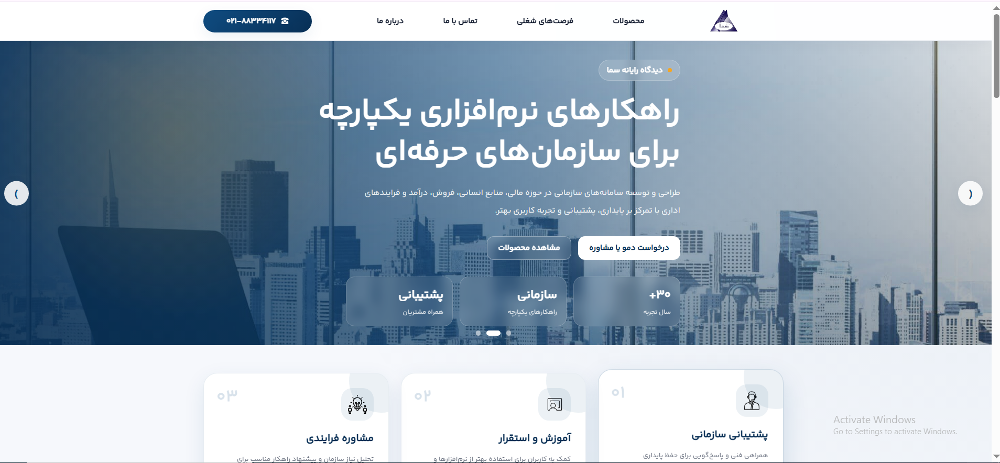
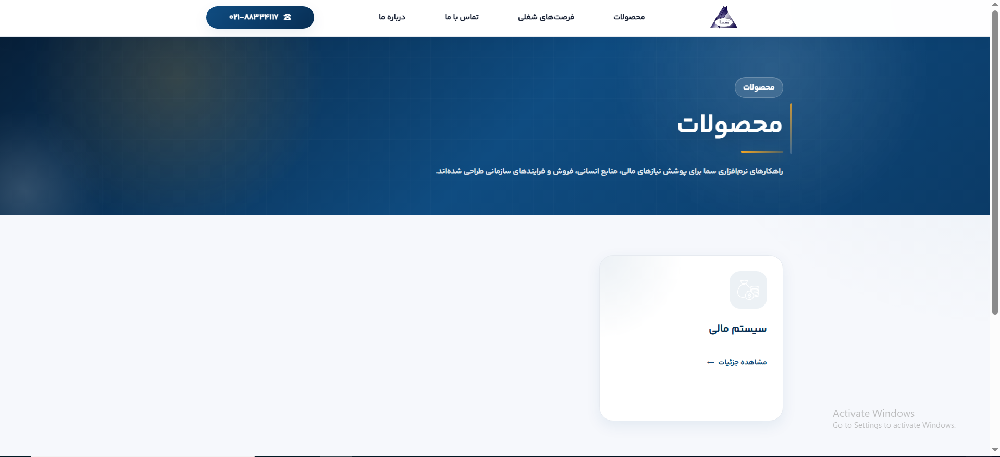
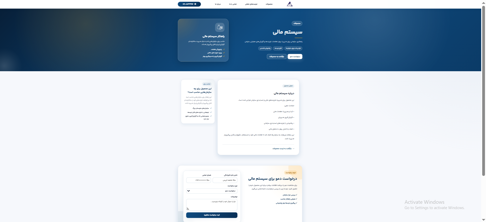
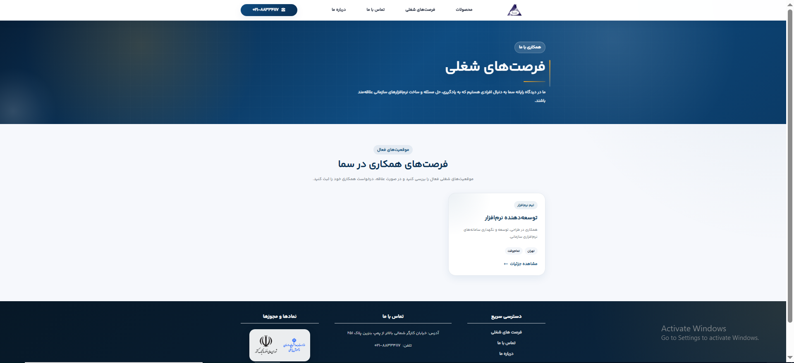
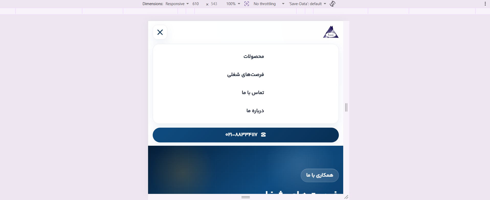
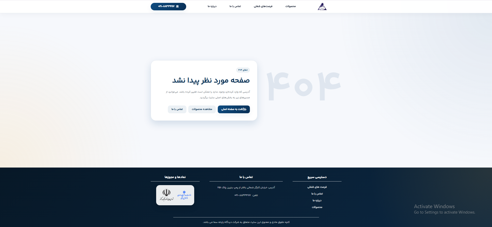

# DRS Umbraco CMS Pilot

A CMS-driven corporate website pilot built with **Umbraco CMS**, **ASP.NET Core**, and **SQL Server**.

This project was created as a migration and modernization pilot from a WordPress/Elementor-based website to a more maintainable .NET-based CMS architecture.

## Highlights

- Migrated a WordPress/Elementor-style corporate website concept into an Umbraco CMS pilot.
- Built reusable Razor templates with a shared master layout.
- Created dynamic CMS-managed sections for products, news, recruitment, and job details.
- Implemented a custom ASP.NET Core API for form submissions.
- Integrated form submissions with existing legacy Elementor database tables.
- Added SEO metadata, sitemap.xml, robots.txt, custom 404 page, and responsive navigation.
- Documented deployment and final QA checklists for production readiness.

## Project Goal

The goal of this project is to rebuild a company website using Umbraco CMS while keeping the content editable for non-technical users and preparing the codebase for future backend extensions.

The website includes dynamic content pages, reusable layouts, custom styling, form submission handling, and integration with existing legacy WordPress/Elementor database tables.

## Tech Stack

- ASP.NET Core
- Umbraco CMS
- SQL Server
- Razor Views
- HTML / CSS / JavaScript
- IIS-ready deployment structure
- Git version control

## Main Features

- CMS-managed homepage content
- Shared master layout for header and footer
- Dynamic news listing page
- Dynamic news detail pages
- Dynamic product listing page
- Dynamic product detail pages
- About page
- Contact page
- Recruitment page
- Job detail pages
- Custom 404 error page
- Responsive mobile navigation
- RTL Persian UI
- Custom CSS design system
- Form submission API
- SQL Server integration
- Legacy Elementor form table integration

## Pages

The current website structure includes:

- `/`
- `/products/`
- `/products/{product-name}/`
- `/news/`
- `/news/{article-name}/`
- `/about-us/`
- `/contact-us/`
- `/recruitment/`
- `/recruitment/{job-opening}/`
- Custom 404 page

## Architecture Overview

The project uses Umbraco for managing website content and ASP.NET Core for custom backend behavior.

```text
Browser
  ↓
Umbraco CMS Website
  ↓
Razor Templates
  ↓
Custom CSS / JavaScript
  ↓
ASP.NET Core API
  ↓
SQL Server
```

## Content Management

Content editors can manage the following through Umbraco Backoffice:

- Homepage content
- News articles
- Product pages
- Contact page content
- About page content
- Recruitment opportunities
- Job descriptions
- 404 page content

## Custom API

The project includes a custom API endpoint for form submissions:

```text
POST /api/consult-requests
```

This endpoint currently handles:

- Demo requests
- Contact messages
- Job interest submissions

The submitted data is stored in existing legacy Elementor-related tables:

```text
wp_e_submissions
wp_e_submissions_values
```

This was done to keep compatibility with the existing WordPress database structure during the migration pilot.

## Responsive UI

The website includes responsive layouts for:

- Header and mobile navigation
- Homepage sections
- Product cards
- News cards
- Contact form
- Recruitment pages
- Footer
- Custom 404 page

## Security Notes

Sensitive configuration files are excluded from Git:

```text
appsettings.json
appsettings.Development.json
appsettings.Production.json
appsettings.*.json
```

A safe sample configuration file should be used instead:

```text
appsettings.example.json
```

Real connection strings, passwords, and environment-specific settings must not be committed to the repository.

## Local Development

Run the project:

```bash
cd DrsUmbraco.Cms
dotnet run
```

Local URLs:

```text
http://localhost:26200
https://localhost:44398
```

Umbraco Backoffice:

```text
http://localhost:26200/umbraco
```

## Database

The project uses SQL Server as the Umbraco database provider.

The pilot also connects to existing WordPress/Elementor tables for form submission compatibility.

## Current Status

Completed:

- CMS setup
- Main website pages
- Dynamic news section
- Dynamic products section
- Contact page
- About page
- Recruitment pages
- Job detail pages
- Custom 404 page
- Responsive mobile navigation
- Custom form submission API
- CSS refactor step 1

Planned improvements:

- Separate APIs for contact messages and job applications
- Resume upload support for recruitment forms
- SEO metadata improvements
- Production deployment on IIS
- Further CSS component refactoring

## Screenshots

### Homepage



### Products



### Product Detail



### Contact Page


### Recruitment Page



### Mobile Menu



### Custom 404 Page



```text
docs/screenshots/
```

Suggested screenshots:

- Homepage
- Product list
- Product detail
- News list
- Contact page
- Recruitment page
- Mobile menu
- 404 page

## What I Practiced in This Project

- Building a real CMS-driven website with Umbraco
- Designing reusable Razor templates
- Creating dynamic content structures
- Working with SQL Server
- Building custom ASP.NET Core APIs
- Handling form submissions
- Migrating concepts from WordPress to Umbraco
- Structuring a maintainable project
- Improving responsive UI
- Using Git safely with environment-specific configuration